# 🛑 SafetySnap

<h1 align="center">SafetySnap: AI-Powered OSHA Violation Detection</h1>

  Spot OSHA violations before they become problems with AI-powered analysis for construction workers

## 🚧 The Problem

Construction sites are hazardous environments where safety violations can lead to serious injuries, fatalities, and costly penalties. Identifying OSHA violations early is crucial, but:

- Safety managers can't be everywhere at once  
- Workers may not recognize potential hazards  
- Documentation and reporting are often cumbersome  
- Violations frequently go unnoticed until inspections or incidents  

## 💡 Our Solution

**SafetySnap** empowers construction workers to be proactive safety advocates by allowing them to:

1. **Snap a Photo** of potential hazards at their worksite  
2. **Analyze Instantly** using Gemini AI to identify OSHA violations  
3. **Get Results** with clear feedback and actionable recommendations  

## ✨ Key Features

| Feature | Description |
|--------|-------------|
| 🔍 **Real-time OSHA Violation Detection** | Instantly identify potential safety hazards and OSHA violations |
| 📊 **Detailed Compliance Reports** | Generate comprehensive documentation for safety records and reporting |
| 📸 **Photo Documentation** | Maintain a visual record of safety conditions for analysis and improvements |
| 📈 **Actionable Insights** | Receive practical steps to address safety concerns and maintain compliance |
| 🛡️ **Preventative Safety Measures** | Identify potential issues before they lead to accidents |

## 🚀 How It Works

1. **Snap a Photo**  
   Take a picture of an area of concern at your construction site.

2. **AI Analysis**  
   The image is instantly analyzed using Gemini AI to detect potential OSHA violations.

3. **Get Results**  
   Receive detailed feedback highlighting any violations, along with recommended actions to improve safety and maintain compliance.

## 🛠️ Technology Stack

- **Frontend**: Next.js, React  
- **Backend**: Node.js, Express  
- **AI Integration**: Google Gemini API  
- **Authentication**: Supabase  
- **Styling**: Tailwind CSS  
- **Deployment**: Vercel  

## 💻 Usage

- Sign up for an account or log in  
- Upload a photo of a potential safety concern  1
- Review the AI analysis for OSHA violations  
- Get recommended actions to address any identified issues  
- Save and share the results with your team  

## 🔮 Flow Diagram

## 👥 The Team

SafetySnap was created during a hackathon by **Mahdi**, **Cole**, and **Noah**.

## 📜 License

This project is licensed under the MIT License – see the [LICENSE](LICENSE) file for details.
